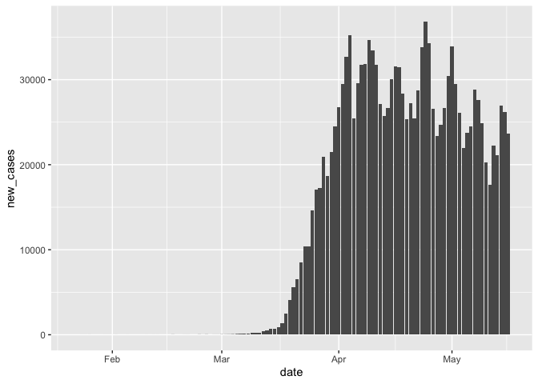
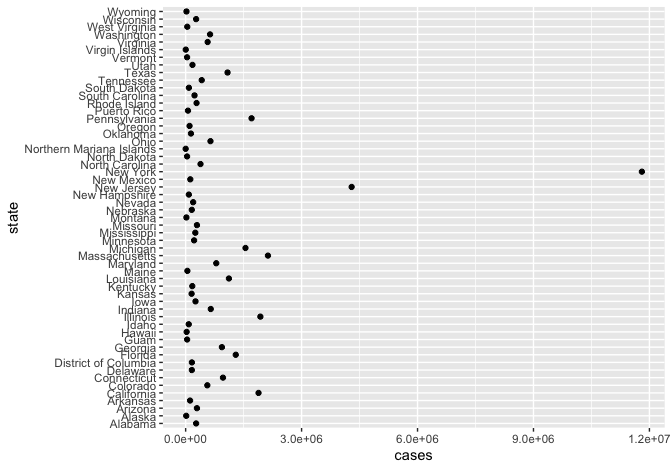
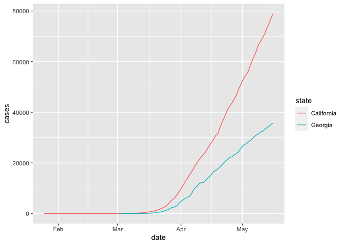

NYT Covid cases
================
Your name
2020-05-17

  - [States](#states)
      - [Glimpse and summary](#glimpse-and-summary)
      - [Check the states](#check-the-states)
      - [Missing values](#missing-values)
  - [Counties](#counties)
      - [Glimpse and summary](#glimpse-and-summary-1)
      - [Check counties and states](#check-counties-and-states)
      - [Missing values](#missing-values-1)
  - [Visualizations](#visualizations)
      - [U.S. cases over time](#u.s.-cases-over-time)
      - [Which state has the most
        cases?](#which-state-has-the-most-cases)
      - [Which state has the most cases per
        capita?](#which-state-has-the-most-cases-per-capita)
      - [State daily cases](#state-daily-cases)
  - [Counties](#counties-1)
  - [Compare trends across states](#compare-trends-across-states)

``` r
# Libraries
library(tidyverse)

# Parameters
  # To get these URLs, I:
    # Step 1: Go here: https://github.com/nytimes/covid-19-data
    # Step 2: Click on the CSV file 
    # Step 3: Click "Raw" or "View raw"
    # Step 4: Copy the URL

  # URL for the county data
url_counties <- 
  "https://raw.githubusercontent.com/nytimes/covid-19-data/master/us-counties.csv"
  # URl for the state data
url_states <- 
  "https://raw.githubusercontent.com/nytimes/covid-19-data/master/us-states.csv"
file_population <- "data/populations.csv"
#===============================================================================

# For reading in the data--we'll get to this in a bit!

# col_types = 
#   cols(
#     date = col_date(format = ""),
#     county = col_character(),
#     state = col_character(),
#     fips = col_integer(),
#     cases = col_double(),
#     deaths = col_double()
#   )
counties <-
  url_counties %>% 
  read_csv()

# col_types = 
#   cols(
#     date = col_date(format = ""),
#     state = col_character(),
#     fips = col_integer(),
#     cases = col_double(),
#     deaths = col_double()
#   )
states <-
  url_states %>% 
  read_csv()

# col_types =
#   cols(
#     region = col_character(),
#     fips = col_integer(),
#     population = col_double()
#   )
population <-
  file_population %>% 
  read_csv()
```

## States

### Glimpse and summary

### Check the states

``` r
n_distinct(states$state)
```

    ## [1] 55

``` r
unique(states$state)
```

    ##  [1] "Washington"               "Illinois"                
    ##  [3] "California"               "Arizona"                 
    ##  [5] "Massachusetts"            "Wisconsin"               
    ##  [7] "Texas"                    "Nebraska"                
    ##  [9] "Utah"                     "Oregon"                  
    ## [11] "Florida"                  "New York"                
    ## [13] "Rhode Island"             "Georgia"                 
    ## [15] "New Hampshire"            "North Carolina"          
    ## [17] "New Jersey"               "Colorado"                
    ## [19] "Maryland"                 "Nevada"                  
    ## [21] "Tennessee"                "Hawaii"                  
    ## [23] "Indiana"                  "Kentucky"                
    ## [25] "Minnesota"                "Oklahoma"                
    ## [27] "Pennsylvania"             "South Carolina"          
    ## [29] "District of Columbia"     "Kansas"                  
    ## [31] "Missouri"                 "Vermont"                 
    ## [33] "Virginia"                 "Connecticut"             
    ## [35] "Iowa"                     "Louisiana"               
    ## [37] "Ohio"                     "Michigan"                
    ## [39] "South Dakota"             "Arkansas"                
    ## [41] "Delaware"                 "Mississippi"             
    ## [43] "New Mexico"               "North Dakota"            
    ## [45] "Wyoming"                  "Alaska"                  
    ## [47] "Maine"                    "Alabama"                 
    ## [49] "Idaho"                    "Montana"                 
    ## [51] "Puerto Rico"              "Virgin Islands"          
    ## [53] "Guam"                     "West Virginia"           
    ## [55] "Northern Mariana Islands"

``` r
states %>% 
  filter(!state %in% state.name) %>% 
  count(state, sort = TRUE)
```

    ## # A tibble: 5 x 2
    ##   state                        n
    ##   <chr>                    <int>
    ## 1 District of Columbia        71
    ## 2 Puerto Rico                 65
    ## 3 Virgin Islands              64
    ## 4 Guam                        63
    ## 5 Northern Mariana Islands    50

### Missing values

``` r
states %>% 
  summarize_all(~sum(is.na(.)))
```

    ## # A tibble: 1 x 5
    ##    date state  fips cases deaths
    ##   <int> <int> <int> <int>  <int>
    ## 1     0     0     0     0      0

`cases` and `deaths` are the *cumulative* counts, so they should never
go down (see the
[documentation](https://github.com/nytimes/covid-19-data)). Is that
true?

``` r
states %>% 
  group_by(
    # TODO: ADD NAME OF VARIABLE
  ) %>% 
  filter(lead(cases, order_by = date) < cases)
```

    ## # A tibble: 2,147 x 5
    ##    date       state      fips  cases deaths
    ##    <date>     <chr>      <chr> <dbl>  <dbl>
    ##  1 2020-01-26 California 06        2      0
    ##  2 2020-01-27 California 06        2      0
    ##  3 2020-01-28 California 06        2      0
    ##  4 2020-01-29 California 06        2      0
    ##  5 2020-01-30 Illinois   17        2      0
    ##  6 2020-01-31 California 06        3      0
    ##  7 2020-01-31 Illinois   17        2      0
    ##  8 2020-02-01 California 06        3      0
    ##  9 2020-02-01 Illinois   17        2      0
    ## 10 2020-02-02 California 06        6      0
    ## # … with 2,137 more rows

``` r
states %>% 
  group_by(
    # TODO: ADD NAME OF VARIABLE
  ) %>% 
  filter(lead(deaths, order_by = date) < deaths)
```

    ## # A tibble: 1,625 x 5
    ##    date       state      fips  cases deaths
    ##    <date>     <chr>      <chr> <dbl>  <dbl>
    ##  1 2020-02-29 Washington 53       10      1
    ##  2 2020-03-01 Washington 53       17      3
    ##  3 2020-03-02 Washington 53       23      6
    ##  4 2020-03-03 Washington 53       32     10
    ##  5 2020-03-04 California 06       55      1
    ##  6 2020-03-04 Washington 53       47     11
    ##  7 2020-03-05 California 06       67      1
    ##  8 2020-03-05 Washington 53       75     11
    ##  9 2020-03-06 California 06       81      1
    ## 10 2020-03-06 Florida    12        7      2
    ## # … with 1,615 more rows

## Counties

### Glimpse and summary

``` r
glimpse(counties)
```

    ## Rows: 150,169
    ## Columns: 6
    ## $ date   <date> 2020-01-21, 2020-01-22, 2020-01-23, 2020-01-24, 2020-01-24, 2…
    ## $ county <chr> "Snohomish", "Snohomish", "Snohomish", "Cook", "Snohomish", "O…
    ## $ state  <chr> "Washington", "Washington", "Washington", "Illinois", "Washing…
    ## $ fips   <chr> "53061", "53061", "53061", "17031", "53061", "06059", "17031",…
    ## $ cases  <dbl> 1, 1, 1, 1, 1, 1, 1, 1, 1, 1, 1, 1, 1, 1, 1, 1, 1, 1, 1, 1, 1,…
    ## $ deaths <dbl> 0, 0, 0, 0, 0, 0, 0, 0, 0, 0, 0, 0, 0, 0, 0, 0, 0, 0, 0, 0, 0,…

``` r
summary(counties)
```

    ##       date               county             state               fips          
    ##  Min.   :2020-01-21   Length:150169      Length:150169      Length:150169     
    ##  1st Qu.:2020-04-06   Class :character   Class :character   Class :character  
    ##  Median :2020-04-20   Mode  :character   Mode  :character   Mode  :character  
    ##  Mean   :2020-04-19                                                           
    ##  3rd Qu.:2020-05-04                                                           
    ##  Max.   :2020-05-16                                                           
    ##      cases              deaths        
    ##  Min.   :     0.0   Min.   :    0.00  
    ##  1st Qu.:     3.0   1st Qu.:    0.00  
    ##  Median :    14.0   Median :    0.00  
    ##  Mean   :   275.9   Mean   :   14.93  
    ##  3rd Qu.:    63.0   3rd Qu.:    2.00  
    ##  Max.   :196481.0   Max.   :20071.00

### Check counties and states

``` r
n_distinct(counties$county)
```

    ## [1] 1727

``` r
n_distinct(counties$state)
```

    ## [1] 55

``` r
unique(counties$state)
```

    ##  [1] "Washington"               "Illinois"                
    ##  [3] "California"               "Arizona"                 
    ##  [5] "Massachusetts"            "Wisconsin"               
    ##  [7] "Texas"                    "Nebraska"                
    ##  [9] "Utah"                     "Oregon"                  
    ## [11] "Florida"                  "New York"                
    ## [13] "Rhode Island"             "Georgia"                 
    ## [15] "New Hampshire"            "North Carolina"          
    ## [17] "New Jersey"               "Colorado"                
    ## [19] "Maryland"                 "Nevada"                  
    ## [21] "Tennessee"                "Hawaii"                  
    ## [23] "Indiana"                  "Kentucky"                
    ## [25] "Minnesota"                "Oklahoma"                
    ## [27] "Pennsylvania"             "South Carolina"          
    ## [29] "District of Columbia"     "Kansas"                  
    ## [31] "Missouri"                 "Vermont"                 
    ## [33] "Virginia"                 "Connecticut"             
    ## [35] "Iowa"                     "Louisiana"               
    ## [37] "Ohio"                     "Michigan"                
    ## [39] "South Dakota"             "Arkansas"                
    ## [41] "Delaware"                 "Mississippi"             
    ## [43] "New Mexico"               "North Dakota"            
    ## [45] "Wyoming"                  "Alaska"                  
    ## [47] "Maine"                    "Alabama"                 
    ## [49] "Idaho"                    "Montana"                 
    ## [51] "Puerto Rico"              "Virgin Islands"          
    ## [53] "Guam"                     "West Virginia"           
    ## [55] "Northern Mariana Islands"

### Missing values

``` r
counties %>% 
  summarize_all(~sum(is.na(.)))
```

    ## # A tibble: 1 x 6
    ##    date county state  fips cases deaths
    ##   <int>  <int> <int> <int> <int>  <int>
    ## 1     0      0     0  1685     0      0

``` r
# TODO: investigate further
```

## Visualizations

### U.S. cases over time

``` r
us <-
  states %>% 
  group_by(date) %>% 
  summarize(cases = sum(cases))
```

    ## `summarise()` ungrouping (override with `.groups` argument)

``` r
# us %>% 
#   ggplot(aes(TODO: Add x and y variables)) +
#   geom_line()
```

``` r
us_daily <-
  us %>% 
  mutate(new_cases = cases - lag(cases, order_by = date)) 

us_daily %>% 
  drop_na(new_cases) %>% 
  ggplot(aes(date, new_cases)) +
  geom_col() 
```

<!-- -->

### Which state has the most cases?

``` r
states_cumulative <-
  states %>% 
  group_by(fips, state) %>% 
  summarize(cases = sum(cases, na.rm = TRUE)) %>% 
  ungroup()
```

    ## `summarise()` regrouping by 'fips' (override with `.groups` argument)

``` r
# This plot is not very useful! Remove to comment to make it better
states_cumulative %>% 
  # mutate(state = fct_reorder(state, cases)) %>% 
  ggplot(aes(cases, state)) +
  geom_point()
```

<!-- -->

### Which state has the most cases per capita?

``` r
# states_cumulative %>% 
#   left_join(population, by = "fips") %>% 
  # filter(!is.na(population)) %>% 
  # mutate(
  #   cases_per_capita = population / cases,
  #   state = fct_reorder(state, cases_per_capita)
  # ) %>% 
  # ggplot(aes(cases_per_capita, state)) +
  # geom_point()
```

### State daily cases

``` r
states %>% 
  group_by(state) %>% 
  mutate(new_cases = cases - lag(cases, order_by = date)) %>% 
  ungroup() # %>% 
```

    ## # A tibble: 4,139 x 6
    ##    date       state      fips  cases deaths new_cases
    ##    <date>     <chr>      <chr> <dbl>  <dbl>     <dbl>
    ##  1 2020-01-21 Washington 53        1      0        NA
    ##  2 2020-01-22 Washington 53        1      0         0
    ##  3 2020-01-23 Washington 53        1      0         0
    ##  4 2020-01-24 Illinois   17        1      0        NA
    ##  5 2020-01-24 Washington 53        1      0         0
    ##  6 2020-01-25 California 06        1      0        NA
    ##  7 2020-01-25 Illinois   17        1      0         0
    ##  8 2020-01-25 Washington 53        1      0         0
    ##  9 2020-01-26 Arizona    04        1      0        NA
    ## 10 2020-01-26 California 06        2      0         1
    ## # … with 4,129 more rows

``` r
  # drop_na(new_cases) %>% 
  # filter(state == "TODO: CHOOSE A STATE") %>% 
  # ggplot(aes(date, new_cases)) +
  # geom_col()
```

## Counties

``` r
counties_cumulative <-
  counties %>% 
  drop_na(fips) %>% 
  group_by(county, state, fips) %>% 
  summarize(cases = sum(cases, na.rm = TRUE)) %>% 
  ungroup()
```

    ## `summarise()` regrouping by 'county', 'state' (override with `.groups` argument)

``` r
counties_cumulative %>% 
  top_n(n = 15, wt = cases) %>% 
  mutate(
    county = str_c(county, ", ", state) %>% fct_reorder(cases)
  ) 
```

    ## # A tibble: 15 x 4
    ##    county                     state         fips    cases
    ##    <fct>                      <chr>         <chr>   <dbl>
    ##  1 Bergen, New Jersey         New Jersey    34003  605306
    ##  2 Cook, Illinois             Illinois      17031 1390557
    ##  3 Essex, New Jersey          New Jersey    34013  509123
    ##  4 Hudson, New Jersey         New Jersey    34017  535334
    ##  5 Los Angeles, California    California    06037  867290
    ##  6 Miami-Dade, Florida        Florida       12086  468428
    ##  7 Middlesex, Massachusetts   Massachusetts 25017  500346
    ##  8 Nassau, New York           New York      36059 1412781
    ##  9 Philadelphia, Pennsylvania Pennsylvania  42101  520768
    ## 10 Rockland, New York         New York      36087  459461
    ## 11 Suffolk, Massachusetts     Massachusetts 25025  450512
    ## 12 Suffolk, New York          New York      36103 1299536
    ## 13 Union, New Jersey          New Jersey    34039  457230
    ## 14 Wayne, Michigan            Michigan      26163  664822
    ## 15 Westchester, New York      New York      36119 1188859

``` r
# TODO: plot cases for top N counties
```

## Compare trends across states

``` r
# TODO: Add or change the states
# TODO: Try a log scale
states %>% 
  filter(state %in% c("California", "Georgia")) %>% 
  ggplot(aes(date, cases, color = state)) +
  geom_line() 
```

<!-- -->
