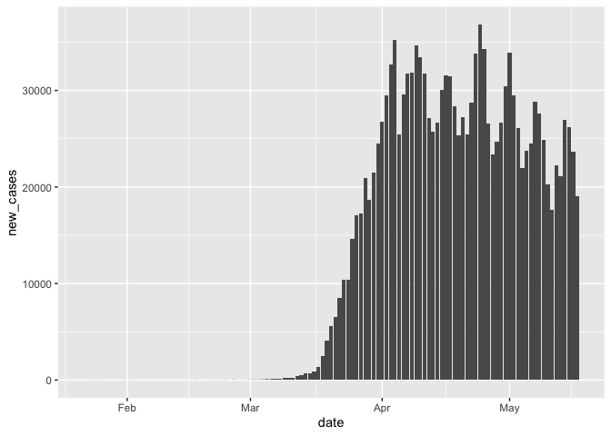
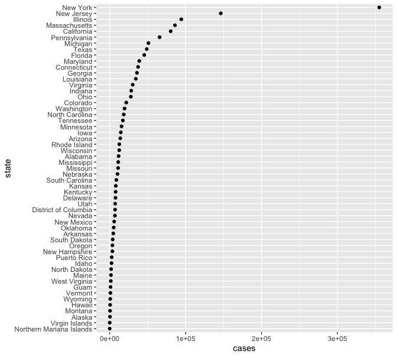

NYT Covid cases
================
Your name
2020-05-17

  - [States](#states)
      - [Summary](#summary)
      - [Check for problems](#check-for-problems)
  - [Counties](#counties)
      - [Glimpse and summary](#glimpse-and-summary)
      - [Check for problems](#check-for-problems-1)
  - [Visualizations](#visualizations)
      - [U.S.](#u.s.)
      - [States](#states-1)
      - [Counties](#counties-1)

``` r
# Libraries
library(tidyverse)

# Parameters
  # To get these URLs, I:
    # Step 1: Go here: https://github.com/nytimes/covid-19-data
    # Step 2: Click on the CSV file 
    # Step 3: Click "Raw" or "View raw"
    # Step 4: Copy the URL
  # URL for the county data
url_counties <- 
  "https://raw.githubusercontent.com/nytimes/covid-19-data/master/us-counties.csv"
  # URl for the state data
url_states <- 
  "https://raw.githubusercontent.com/nytimes/covid-19-data/master/us-states.csv"
file_population <- "data/populations.csv"
NYC_POPULATION <- 8398748
#===============================================================================

counties <-
  url_counties %>% 
  read_csv() 

states <-
  url_states %>% 
  read_csv()

population <-
  file_population %>% 
  read_csv(
    col_types =
      cols(
        region = col_character(),
        fips = col_character(),
        population = col_double()
      )
  )
```

## States

### Summary

``` r
summary(states)
```

    ##       date               state               fips               cases       
    ##  Min.   :2020-01-21   Length:4139        Length:4139        Min.   :     1  
    ##  1st Qu.:2020-03-21   Class :character   Class :character   1st Qu.:    69  
    ##  Median :2020-04-09   Mode  :character   Mode  :character   Median :  1146  
    ##  Mean   :2020-04-07                                         Mean   : 10010  
    ##  3rd Qu.:2020-04-28                                         3rd Qu.:  6644  
    ##  Max.   :2020-05-16                                         Max.   :353136  
    ##      deaths       
    ##  Min.   :    0.0  
    ##  1st Qu.:    1.0  
    ##  Median :   27.0  
    ##  Mean   :  541.6  
    ##  3rd Qu.:  235.5  
    ##  Max.   :27953.0

### Check for problems

Missing values, errors, etc.

## Counties

### Glimpse and summary

``` r
glimpse(counties)
```

    ## Rows: 150,169
    ## Columns: 6
    ## $ date   <date> 2020-01-21, 2020-01-22, 2020-01-23, 2020-01-24, 2020-01-24, 2…
    ## $ county <chr> "Snohomish", "Snohomish", "Snohomish", "Cook", "Snohomish", "O…
    ## $ state  <chr> "Washington", "Washington", "Washington", "Illinois", "Washing…
    ## $ fips   <chr> "53061", "53061", "53061", "17031", "53061", "06059", "17031",…
    ## $ cases  <dbl> 1, 1, 1, 1, 1, 1, 1, 1, 1, 1, 1, 1, 1, 1, 1, 1, 1, 1, 1, 1, 1,…
    ## $ deaths <dbl> 0, 0, 0, 0, 0, 0, 0, 0, 0, 0, 0, 0, 0, 0, 0, 0, 0, 0, 0, 0, 0,…

``` r
summary(counties)
```

    ##       date               county             state               fips          
    ##  Min.   :2020-01-21   Length:150169      Length:150169      Length:150169     
    ##  1st Qu.:2020-04-06   Class :character   Class :character   Class :character  
    ##  Median :2020-04-20   Mode  :character   Mode  :character   Mode  :character  
    ##  Mean   :2020-04-19                                                           
    ##  3rd Qu.:2020-05-04                                                           
    ##  Max.   :2020-05-16                                                           
    ##      cases              deaths        
    ##  Min.   :     0.0   Min.   :    0.00  
    ##  1st Qu.:     3.0   1st Qu.:    0.00  
    ##  Median :    14.0   Median :    0.00  
    ##  Mean   :   275.9   Mean   :   14.93  
    ##  3rd Qu.:    63.0   3rd Qu.:    2.00  
    ##  Max.   :196481.0   Max.   :20071.00

### Check for problems

## Visualizations

### U.S.

``` r
us <-
  states %>% 
  group_by(date) %>% 
  summarize(cases = sum(cases))

us_daily <-
  us %>% 
  mutate(new_cases = cases - lag(cases, order_by = date)) 
```

``` r
us_daily %>% 
  drop_na(new_cases) %>% 
  ggplot(aes(date, new_cases)) +
  geom_col()
```

<!-- -->

### States

``` r
states_latest <-
  states %>% 
  group_by(fips) %>% 
  filter(date == max(date)) %>% 
  ungroup() %>% 
  left_join(population %>% select(-region), by = "fips")
```

``` r
# distribution
states_latest %>% 
  mutate(state = fct_reorder(state, cases)) %>% 
  ggplot(aes(cases, state)) +
  geom_point()
```

<!-- -->

### Counties

``` r
counties_latest <-
  counties %>%
  drop_na(fips) %>%
  group_by(fips) %>%
  filter(date == max(date)) %>%
  ungroup() %>%
  left_join(population %>% select(-region), by = "fips") #%>% 
  # mutate(
  #   population = if_else(county == "New York City", NYC_POPULATION, population),
  #   cases_per_100 = (cases / population) * 100
  # ) %>% 
  # filter(!is.na(population))
```

``` r
# counties_latest %>% 
#   ggplot(aes(cases_per_100)) +
#   geom_histogram(binwidth = 0.3)
```

``` r
# counties_latest %>% 
#   mutate(cases_per_100 = (cases / population) * 100) %>% 
#   top_n(n = 30, wt = cases_per_100) 
```
